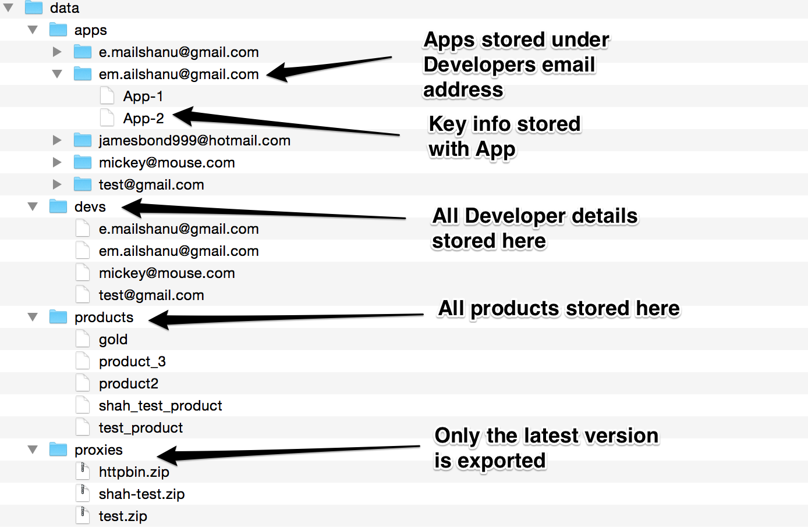

# Apigee Organization Data Migration Tool

This is a tool for migrating configuration information and entities from one Apigee Edge organization to another. With the tool, you can:

- Export data from an org
  - Developers
  - Proxies (latest version)
  - Products
  - Apps
  - App Keys
  - KVM (Org and Env)
  - Reports
- Import data to an org
  - Developers
  - Proxies (latest version) and deploy them 
  - Products
  - Apps
  - App Keys
  - KVM (coming soon)
  - Reports
- Import data from a csv file to an org
  - Developers
  - Apps
  - App Keys
  - KVM (Org and Env)

**IMPORTANT**
- Make a backup of both systems using the backup scripts provided with the OPDK before running this tool.
- All export tasks work on the “from” configurations in your config.js and store the data in the “data” folder on your local system.
- All imports and delete tasks work on the “to” configurations in config.js. 
- **Deletes made using these scripts cannot be rollbacked. Please use delete commands with caution.**

License -  [MIT](https://github.com/apigeecs/apigee-migrate-tool/blob/master/LICENSE) 

## Installation

1.	Download and Install node at http://nodejs.org/download/.

2.	Open a command prompt and install grunt using the command.

	```
	npm install -g grunt-cli
	```

3.	Download the tool or git clone the repo.

4.	Install the node dependencies. 

	```
	npm install
	```

5.	Edit the config.js file to suit your environment.

	```
	module.exports = {

		from: {
			version: 'R22',
			url: 'http://mgmt-server’,
			userid: 'user-id’,
			passwd: 'your-password',
			org: 'your-org',
			env: 'your-env'
		},
		to: {
			version: '14.0.7',
			url: 'http://mgmt-server’,
			userid: 'user-id’,
			passwd: 'your-password',
			org: 'your-org',
			env: 'your-env'
		}
	} ;
	```

6.	Run `grunt` to run all the grunt tasks.

 


## Usage

### To export all data types 
```
	grunt exportAll -v
```	
	The switch `-v` is for verbose mode. The following folder structure with data will be created in your current directory.

 


### To import Developers

```
	grunt importDevs -v 
```

You may want to redirect standard out to log files, so they can be reviewed later. It will import all the developers from the data/devs folder to the org specified in the *to* configuration in your config.js file.

### When importing, run tasks in the following sequence

 `importProxies` -> `importDevs` -> `importProducts` -> `importApps` -> `importKeys`

By default the `importDevs`, `importApps`, and `importKeys` tasks import all the entities from the respective data folder. 

### To import a specific entity you can pass an argument `src` as shown below.

```
	grunt importApps -v --src=./data/apps/*/App*
```
	
The above command will import all apps starting with "App" irrespective of the developer the app belongs to. 
For more details on other globbing patterns supported please refer to [Globbing Pattern] (http://gruntjs.com/configuring-tasks#globbing-patterns).

### To import Developers or Apps from a csv file.

```
	grunt readCSVDevs -v 
```

The above command will read the input/devs.csv file and generate the developer json files in the data/devs folder. These developers can then be imported to your org using the importDevs command shown earlier. 

A sample devs.csv file is shown below.


This will create a corresponding json in the data/devs/mqb2btools@whatever.com, as shown below.


You can also import Apps from a csv file in a similar way. Take a look at the sample apps.csv in the input folder.
