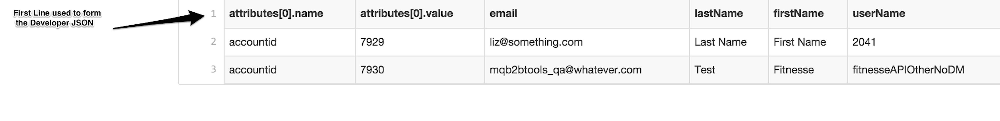
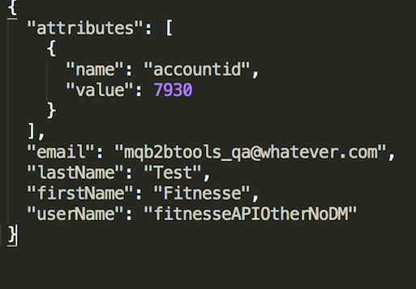

# Apigee Organization Data Migration Tool

Use this tool to migrate configuration information and entities from one Apigee Edge organization to another.

**IMPORTANT**
- Make a backup of both systems using the backup scripts provided with the OPDK before running this tool.
- All export tasks work on the “from” configurations in your config.js and store the data in the “data” folder on your local system.
- All imports and delete tasks work on the “to” configurations in config.js.
- **Deletes made using these scripts cannot be rolled back. Please use delete commands with caution.**

> The migration tool supports only basic authentication when authenticating with your Apigee orgs. If you're using 2-factor authentication or bearer tokens, you may need to temporarily disable that requirement in order to use the tool.

License -  [MIT](https://github.com/apigeecs/apigee-migrate-tool/blob/master/LICENSE)

## Data migrated

With the tool, you can import and export data about:
- developers
- proxies (latest version)
- shared flows
- flow hooks
- products
- apps
- app keys
- KVMs (org and env)
- Reports
- Spec store (Not available on-premises. Spec store APIs are in experimental status, so may change in the future)
- Target Servers

You can also import the following kinds of data from a CSV file to an Apigee org:
  - developers
  - apps
  - app Keys
  - KVMs (org and env)

## Data not migrated

**Please note** that the following entities won't be migrated as part of this tool. In most cases, you'll need to migrate these manually using the Apigee Edge console. For more on migrating these, see the Apigee [documentation on org data migration](https://docs.apigee.com/api-services/content/migrating-data-apigee-trial-org).
 - Cache resources and cached values.
 - Environment resources such as virtualhosts, and keystores.
 - KVM entries for "encrypted" key-value maps. Encrypted values can't be retrieved using the management API. Make a note of the values you're using in your old org, then add these values manually to the new org.
 - Organization or environment level resources such as .jar files, .js files, and so on.

## Installing the tool

1. Download and install Node.js at http://nodejs.org/download/.
1. Open a command prompt and install Grunt using the `npm` command.
    ```
    npm install -g grunt-cli
    ```
1. To get the tool, clone this repository.
    ```
    git clone https://github.com/apigeecs/apigee-migrate-tool.git
    ```
1. Install the Node.js dependencies that the tool requires.
    ```
    npm install
    ```

## Using the tool to migrate an org

Migrating includes the following steps:

1. Collect information about the orgs you're migrating from and importing to.
1. Configure the tool with information about your orgs.
1. Run grunt tasks in the migration tool to export org data to your local drive, then import the data to another org.
1. Verify that the data you migrated works as it should in the new org.

### Before you get started

Before you start migrating data, be sure to do the following to ensure that your org is in a stable state when migrating.

- Freeze revisions on proxies in the org you're exporting from.
- Pause the process of adding new proxies or features.

### Configuring the tool for your orgs

Before you run commands to export and import data, you need to configure the migration tool to access your Apigee organizations.

In the root directory of the repository you cloned, you'll find a config.js file. Edit that file to add values specific to your old and new orgs. Add the following kinds of information for each of your orgs -- the one you're exporting from and the one you're importing to.

Property | Description
--- | ---
version | The version of Apigee Edge
url | URL for the management server where the proxies and other data are hosted. For example, this might be https://api.enterprise.apigee.com
userid | Username for a user with permission to log in to your org
passwd | Password for a user with permission to log in to your org
org | The organization to export from or import to
env | The environment to export from or import to

    Here's an example of an edited config.js:


    ```
    module.exports = {
        from: {
			version: '1',
			url: 'https://api.enterprise.apigee.com',
			userid: 'me@example.com',
			passwd: 'mypassword',
			org: 'my-old-org',
			env: 'my-old-env'
        },
        to: {
			version: '1',
			url: 'https://api.enterprise.apigee.com',
			userid: 'me@example.com',
			passwd: 'mypassword',
			org: 'my-new-org',
			env: 'my-new-env'
        }
    } ;
    ```

## Using the tool

Once you've configured the tool with information about your orgs, you can run it to export and import data. To use the tool, open a command prompt and change to the root directory of the repository you cloned.

To see a list of all the tasks available with the tool, run the grunt command.

```
grunt
```

To try out the tool, you can run the exportAll task to export all of the supported kinds of data from the old org you specified in configuration. (The switch `-v` is for verbose mode.)

```
grunt exportAll -v
```

The following folder structure with data will be created in your current directory.


> You may want to redirect standard out to log files, so you can review them later.

### Running migration tasks

You can run the export and import tasks separately for each kind of org data. When you do, be sure to run them in the proper sequence. Some kinds of data are dependent on the presence of others in order to succesfully import or export.

> Keep in mind that `delete` tasks -- which operate on the "to" org -- require the presence of exported data in this tool's data folder. The `delete` tasks use the exported data to discover what should be deleted from the "to" org.

#### Sequence for exporting data
```
grunt exportProducts
grunt exportDevs
grunt exportApps
grunt exportProxies
grunt exportSharedFlows
grunt exportTargetServers
grunt exportProxyKVM
grunt exportEnvKVM
grunt exportOrgKVM
```

#### Sequence for importing data
```
grunt importTargetServers
grunt importProxies
grunt importSharedFlows
grunt importDevs
grunt importProducts
grunt importApps
grunt importKeys
grunt importProxyKVM
grunt importEnvKVM
grunt importOrgKVM
```

By default the `importDevs`, `importApps`, and `importKeys` tasks import all the entities from the respective data folder.

### Importing a specific entity

To import a specific entity, use the `src` argument to specify which entity data you want to import.

```
grunt importApps -v --src=./data/apps/*/App*
```


The preceding command will import all apps starting with "App" irrespective of the developer the app belongs to.

For more details on other globbing patterns supported please refer to [Globbing Pattern](http://gruntjs.com/configuring-tasks#globbing-patterns).

### Importing developer or app data from a CSV file

You can import developer or app data from a CSV file by using either the readCSVDevs or readCSVApps command, as shown here.

```
grunt readCSVDevs -v
```

The preceding command will read the file at input/devs.csv to generate the developer JSON files in the data/devs folder. These developers can then be imported to your org using the `importDevs` command.

A sample devs.csv file is shown below.



This will create a corresponding json in the data/devs/mqb2btools@whatever.com, as shown below.



## Verify entities in your new org

After you've imported to your new org, you'll want to verify that all the pieces you need are there. For example, you'll want to:

- Make sure all the pieces you imported -- proxies, shared flows, KVMs, and so on -- are in your new org.
- Make sure you manually migrate the pieces that couldn't be migrated with the tool. See the section at the beginning of this topic for a list.
- Deploy and test your proxies using a client to ensure that everything works as it should.
